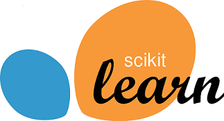

# My Consolidated Learning Projects

Here, I am describing some of the projects that I have done, inspired by courses I took or my personal interests. These projects span across data analysis, machine learning, and SQL.

---

##  General Python Projects

Here, I am describing some of the python projects that I have done. The projects have been performed inspired by the courses that I took or my personal intersts. Four projects are included from which three of them have been completed and I am still working on one of them.

* :chart_with_upwards_trend: [Statistical Analysis](https://github.com/HamedHeli/PythonProjects/blob/182e3699aef0d3d26b58c7990478ec9fb6c857d7/Statistical%20Analysis/Statistical%20Analysis.ipynb) (completed):
    In this project, I am presenting part of statistical analysis that I did for my Ph.D. prject. I am analyzing the properties of one of the human organ (prostate gland) to see which of them is being affected by the cancer. For this purpose, I am finding the **statistics of the data** and calculate **confidence intervals**; then, I try to find the effective properties (on cancer) by defining **alternative hypotheses** and find the **t-score and p-values** for each hypothesis. The properties with low p-value are then introduced as those that will be afffected by cancer. (this project is part of my Ph.D. project and so I removed the parts that I am not yet able to publicly share)

* :chart: [Bank Stock Market](https://github.com/HamedHeli/PythonProjects/blob/016d47925324a5e1714614c3592f54bab88cb5ab/Bank%20Stock%20Market/Bank%20Stock%20After%20Covid%20.ipynb) (completed):
    In this project, I am comparing the performance of six large US bank stock after the pandemic (from Jan 2020 - Dec 2021) and try to explore how they recovered. After processing data, I have **concluded** that:

    * Bank of America, JPMorgan Chase, Goldman Sachs, and Morgan Stanley have similiar performance (correlation > 90%)
    * Bank of America (BAC) has a solid and low-risk perfomace but its return might not be always maximum; it is an appropriate stock for long-term investors
    * Wells Fargo is also shown to be a good second choice as its perfomance is different with that of Bank of America and causes more diverse portfolio
    * CitiGroup is a good choice for short-time traders: it can provide high gains but it is a high-risk investment and it can also lead to high losses

    *Disclaimer: I am not expert in stock (I atually have little knowledge in the field), the conclusions are not meant to be a robust financial analysis or be taken as financial advice.*

* :telephone_receiver: [911 Calls](https://github.com/HamedHeli/PythonProjects/blob/016d47925324a5e1714614c3592f54bab88cb5ab/911%20Calls%20(Capstone%20Project)/911%20Calls%20(Capstone%20Project).ipynb) (completed):
    In this project, I am analyzing 911 call received by Montgomery County, PA, from Dec 2015 - Aug 2016 and try to understnad why and when people are commonly call 911. Here are the **conclusions**:

    * Emergency Medical Services (EMS), Traffic (like car accident), and Fire are respectively the most common reasons people are calling 911.
    * There is no significant difference between the number of EMS and Fire calls received from a day to day, but Sundays and Saturdays show lower number of Traffic calls.
    * Dec shows relatively lower number of 911 calls compared to other months.
    * Most of the calls are received from 6:00 AM to 8:00 PM and it is almost indepenet of the month and day.

* :globe_with_meridians: [Amazon Web Scaping](https://github.com/HamedHeli/PythonProjects/blob/37792adc18700fac596ed54ea407afd143dd8ef5/Website%20Scraping/Amazon/Amazon%20Scraping.ipynb) (completed):
    In this project, I am presenting a program for deriving the production info from the first seven pages of Amazon after searching a custom keyword. The results include

    * Product Title
    * Price
    * Number of Reviews
    * Review Rating
    * Url address

* :movie_camera: [Movie Industry](https://github.com/HamedHeli/PythonProjects/blob/a33ce30fafd909651f29d5ed2a271c7410014c4a/Factors%20of%20Earning%20in%20Movies%20(Correlation)/Factors%20of%20Earning%20in%20Movies.ipynb) (in progress):
    In this project, I am investigating the factors that contribute to a movie's success. This project is in porgress...

---

##  Machine Learning Projects

Here, I am describing the Machine Learning (ML) projects that I have done. The projects have been performed inspired by the courses that I took or my personal intersts.

* :large_blue_diamond: [Predicting Diamond Price (Linear Regression)](https://github.com/HamedHeli/MLProjects/blob/0ce53fae568dc294c96499e4c3b85a37941e1438/Linear%20Regression/Diamond.ipynb):
    In this project, I make a linear model for predicting the diamond's price based on its carate, clarity, color, and cut. Including the data with more than 50,000 rows, I trained the model by using 0.5% of the population (training population) and then test the model using the rest to verify the model's accuracy. The model shows >80% accurracy (in terms of R-squared).

* :computer_mouse:[Predicting Advertising Clicks (Logistic Regression)](https://github.com/HamedHeli/MLProjects/blob/6dc829c39f345fb71c509e6f101739c499058641/Logistic%20Regression/Advertising.ipynb):
    In this project, I make a logistic model for predicting whether or not a particular internet user clicked on an advertisement based off the features of that user. The user's features include age, average income of their living area, the time they spend on internet, and the time they spent on the site. I trained the model by using 40% of the population and evaluate the model perfromance by calculating confusion matrix.

* :dark_sunglasses: [Classifying Anonymized Dataset (KNN Classification)](https://github.com/HamedHeli/MLProjects/blob/6d9ea3fd51c759f83d40a6ba02f18971aad0aaaf/KNN%20Classification/K%20Nearest%20Neighbors.ipynb):
    I have been given a classified data set from a company. They've hidden the feature column names but have given you the data and the target classes. I try to use KNN to create a model that directly predicts a class for a new data point based off of the features.

* :moneybag: [Predicting Loan Paid Back (Decision Tree and Random Forest Classification)](https://github.com/HamedHeli/MLProjects/blob/6d9ea3fd51c759f83d40a6ba02f18971aad0aaaf/Decision%20Tree%20and%20Random%20Forest%20Classification/Ensemble%20Decision%20Trees%20(Random%20Forest).ipynb):
    In this project, I will be exploring publicly available data from [LendingClub.com](https://www.lendingclub.com/). Lending Club connects people who need money (borrowers) with people who have money (investors). Hopefully, as an investor you would want to invest in people who showed a profile of having a high probability of paying you back. I will try to create a model that will help predict this.

* :hibiscus: [Clustering Iris Flower Data Set (Support Vector Machines with Grid Search)](https://github.com/HamedHeli/MLProjects/blob/194e670773d380c3a4528d87a1aa6fc9bee3b91f/Support%20Vector%20Machines/Support%20Vector%20Machines.ipynb):
    For this project, I am using the famous [Iris flower data set](http://en.wikipedia.org/wiki/Iris_flower_data_set) and try to cluster them.
    The Iris flower data set or Fisher's Iris data set is a multivariate data set introduced by Sir Ronald Fisher in the 1936 as an example of discriminant analysis.
    The data set consists of 50 samples from each of three species of Iris (Iris setosa, Iris virginica and Iris versicolor), so 150 total samples. Four features were measured from each sample: the length and the width of the sepals and petals, in centimeters. Here, I try to cluster them (pretend that I do not have the labels) by using SVM method while the parameters are chosen by applying Grid Search.

* :school: [Clustering Universtities into Private and Public (K-Means Clustering with Principal Component Analysis)](https://github.com/HamedHeli/MLProjects/blob/194e670773d380c3a4528d87a1aa6fc9bee3b91f/K%20Means%20Clistering/K%20Means%20Clustering.ipynb):
    For this project I will attempt to use KMeans Clustering to cluster Universities into to two groups, Private and Public. It should be noted that I actually have the labels for this data set, but I will not use them for the KMeans clustering algorithm, since that is an unsupervised learning algorithm. Since the number of data features are high, I use Principal Component Analysis (PCA) to reduce the dimensions that apply the algorithm only on the feature that matters.

* :+1: [Classifying Yelp Reviews (Natural Processing Languag Pipelines with Random Forest and Naive Bayesian Classification Method)](https://github.com/HamedHeli/MLProjects/blob/DataAnalysis/NLP/NLP%20Project.ipynb):
    In this NLP project I will be attempting to classify Yelp Reviews into 1 star or 5 star categories based off the text content in the reviews. I will use the Yelp Review Data Set from Kaggle where each observation in this dataset is a review of a particular business by a particular user. I make pipelines with different text processors and classification method and compare the reults by printing confusion matrix.

---

##  SQL Projects

Here, I am describing some of the SQL projects that I have done. The projects have been performed inspired by the courses that I took or my personal intersts.
Two projects are included:

* :scroll: [Common t-sql Transactions](https://github.com/HamedHeli/SQLProjects/blob/cb5cc9fd4e63cd58b37856111aa319af01b319bc/Common%20t-sql/common_t_sql.sql) (completed):
    This project includes the common transactions in SSMS; I use it as a reference. Few examples of the transactions are as follows:

    * Implementing Lookup function in SQL by using JOIN, UNION, and CTE
    * Checking fonr NULL or a string trend in the data
    * Using CASE, COALENSCE, and PARTITION

* :mask: [Covid-19 Data Exploration](https://github.com/HamedHeli/PythonProjects/blob/016d47925324a5e1714614c3592f54bab88cb5ab/Bank%20Stock%20Market/Bank%20Stock%20After%20Covid%20.ipynb) (completed):
    In this project, I got Covid death and vaccination data from [ourworldindata website](https://ourworldindata.org/), cleaned data, and derived initial insights. The following transactions have been performed:

    * Joining Data to Collect Information in the Same Table
    * Data Cleaning and Creating Pivot Table
    * Data Manipulating and Defining New Metrics for Initial Data Insights

* :house: [Nashville Housing Data Cleaning](https://github.com/HamedHeli/SQLProjects/blob/a4c737d50168d407b9ff939d185ae92fb1c8cf1d/Data-Cleaning/DataCleaning.sql) (completed):
    In this project, I cleaned housing market data. The data cleaning procedure includes the following transactions:

    * Detecting null values and filling them by using the data from other rows
    * Breaking the address into stress, city, and states
    * Discovering incosistency in data and modify the information so each column has consistent data
